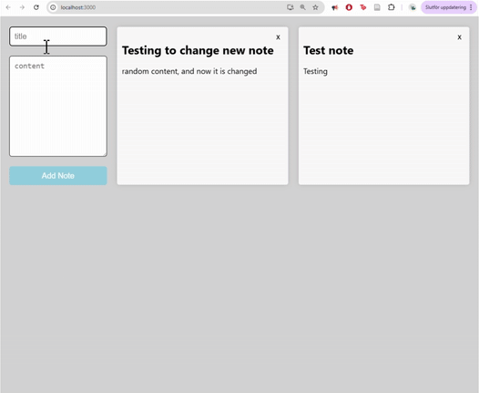

# 📝 Notes App (Fullstack Practice Project)

This is a simple fullstack note-taking application built using **React**, **TypeScript**, **Express**, **Node.js**, and **PostgreSQL** with **Prisma** as the ORM.  

It's a practice project meant to reinforce concepts in fullstack web development!

---

## Demo

---

## Features

- View all notes
- Add a new note
- Edit existing notes
- Delete notes
- Select a note to edit
- Fully typed with TypeScript (frontend & backend)

---

## Tech Stack

**Frontend:**
- React
- TypeScript
- CSS

**Backend:**
- Node.js
- Express
- Prisma ORM
- PostgreSQL

---

## What I Learned

- How to set up a fullstack TypeScript project
- Connecting a PostgreSQL database using Prisma
- Creating and consuming REST APIs
- Handling CRUD operations in both frontend and backend
- Working with forms and local state in React